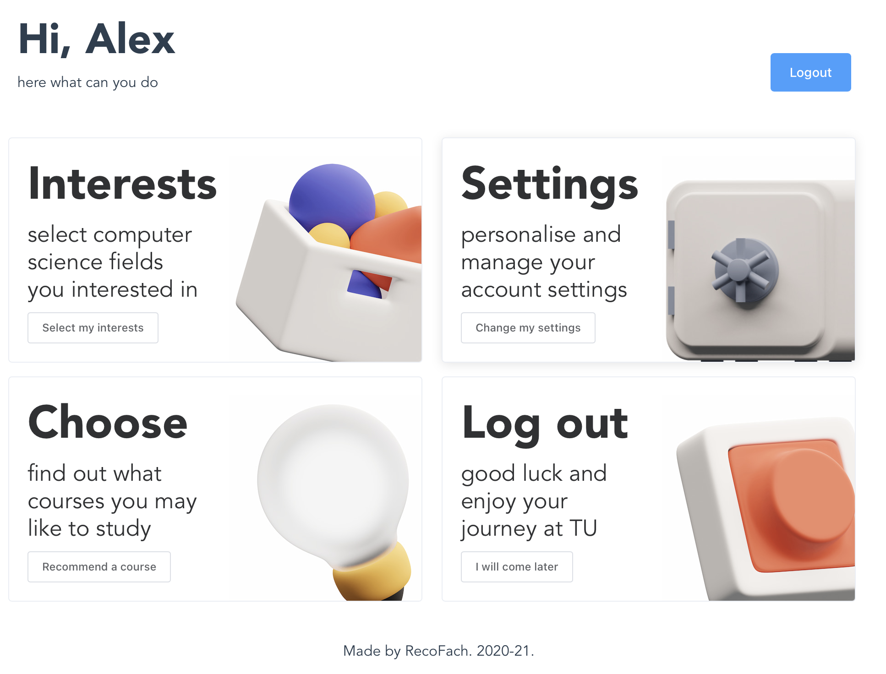

# RecoFach

The faculty of the computer science offers a wide range of subjects, that a student can choose.
Over the last years the amount of subjects rised, due to new institutes, making it harder to get an overview.
RecoFach aims to change it! 

We propose a simple application where students can choose subjects based on the fields of interests.



## Data

From the  TU website [part1](https://wwwdek.inf.tu-dresden.de/lehre/sose/19/lehrangebot.html) and [part 2](https://wwwdek.inf.tu-dresden.de/lehre/wise/21/modullisten/mod-list_inf_Fakultät%20Informatik_wise2021.pdf)  with the list of modules was made a dataset with the following parameters.
* Course name
* Link
* sws;
* german/english
* Type: (Komplexpraktikum, Seminar, Vorlesung) 
* Semester (summer/winter)

## Fields of interests 
Currently we support following fields of interests for students:
* Software engineering 
* AI
* Low-level 
* Security 
* Web 
* Theoretical

## Project setup
To install and run this repo locally for development
perform following steps:

1. Clone the repository.

    ```git clone https://github.com/RecoFach/RecoFach.git```

1. Pull submodules

    ```git submodule update --init --recursive```

1. Build project
    ```docker-compose up --build```

1. [Enjoy](http://localhost:3000) 
